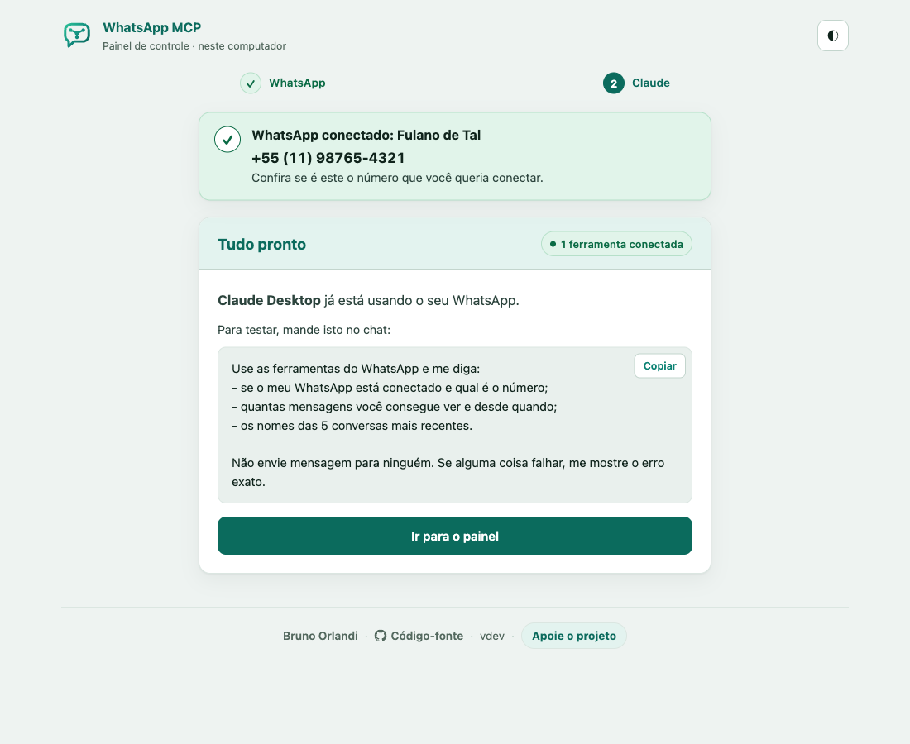
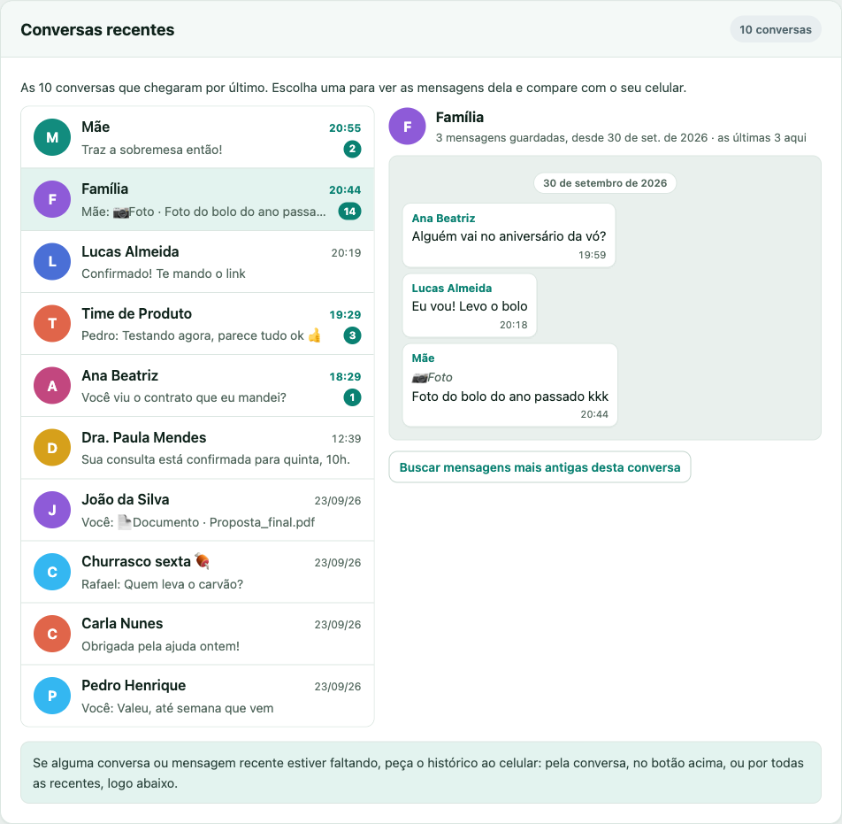

<p align="center">
  
</p>

<h1 align="center">WhatsApp MCP Local</h1>

<p align="center">
  <strong>O seu WhatsApp no Claude, rodando no seu próprio computador.</strong><br>
  Sem servidor, sem mensalidade: as mensagens ficam na sua máquina.
</p>

<p align="center">
  
</p>

Peça ao Claude para resumir uma conversa, achar aquela mensagem de meses atrás,
responder alguém, criar uma enquete ou transcrever um áudio, direto do seu
WhatsApp.

> **Esta é a v2, a versão local.** A [v1](https://github.com/BrOrlandi/whatsapp-mcp)
> roda num servidor na nuvem (uma VPS com Docker, de US$ 7 a US$ 25 por mês) e
> funciona 24 horas, inclusive no claude.ai e no celular. A v2 faz o mesmo no
> seu computador: instala com um prompt, não tem infraestrutura para manter e
> não custa nada. Em troca, só recebe mensagens com o computador ligado.

## Instalar

Copie o texto abaixo e cole no **Claude Code**, no **Cowork** ou em qualquer
agente de IA que rode comandos no seu computador:

```
Instale o WhatsApp MCP neste computador seguindo https://github.com/BrOrlandi/whatsapp-mcp-v2.
Rode: curl -fsSL https://raw.githubusercontent.com/BrOrlandi/whatsapp-mcp-v2/main/install.sh | bash
Se o download falhar (repositório privado), use: gh repo clone BrOrlandi/whatsapp-mcp-v2 && cd whatsapp-mcp-v2 && ./install.sh
Quando o painel abrir no navegador, me diga para escanear o QR code com o celular e depois conectar o Claude pelo próprio painel.
```

O instalador prepara tudo e abre o painel no navegador. Lá você:

1. **escaneia o QR code** com o celular (*WhatsApp › Dispositivos conectados › Conectar dispositivo*);
2. **conecta o Claude** com um clique: Claude Desktop (chat e Cowork) ou Claude Code.

Prefere o terminal? O mesmo comando funciona direto:

```sh
curl -fsSL https://raw.githubusercontent.com/BrOrlandi/whatsapp-mcp-v2/main/install.sh | bash
```

Funciona no macOS e no Linux. Não precisa de `sudo`.

## O painel

Depois da instalação, o painel fica em **http://127.0.0.1:47821** (ou
`whatsapp-mcp-v2 open`). Nele você confere as conversas que chegaram,
compara com o celular, pede histórico mais antigo e vê se está tudo
funcionando.

<p align="center">
  
</p>

## Bom saber

- **Áudios viram texto no próprio Mac.** Em Macs com Apple Silicon, as notas de
  voz são transcritas no computador, de graça e sem o áudio sair dele, usando a
  conversa como contexto para acertar nomes e termos.
- **O computador precisa estar ligado** para receber mensagens. Se ele ficar
  desligado por pouco tempo, o WhatsApp entrega o que ficou pendente quando ele
  volta.
- **Funciona com o Claude Desktop e o Claude Code** neste computador. O
  claude.ai no navegador e o app do celular não alcançam um servidor local.
- **Use por sua conta e risco.** O WhatsApp não tem API oficial para contas
  pessoais. Este projeto usa o [wacli](https://github.com/openclaw/wacli), um
  cliente não oficial, e a conta pode ser desconectada ou restringida.

[Como funciona](docs/como-funciona.md) ·
[Desenvolvimento](docs/desenvolvimento.md) ·
[Apoie o projeto](https://donate.stripe.com/8x200jdhA6c1d375jF9Ve06)

<sub>MIT · feito por [Bruno Orlandi](https://github.com/BrOrlandi)</sub>
