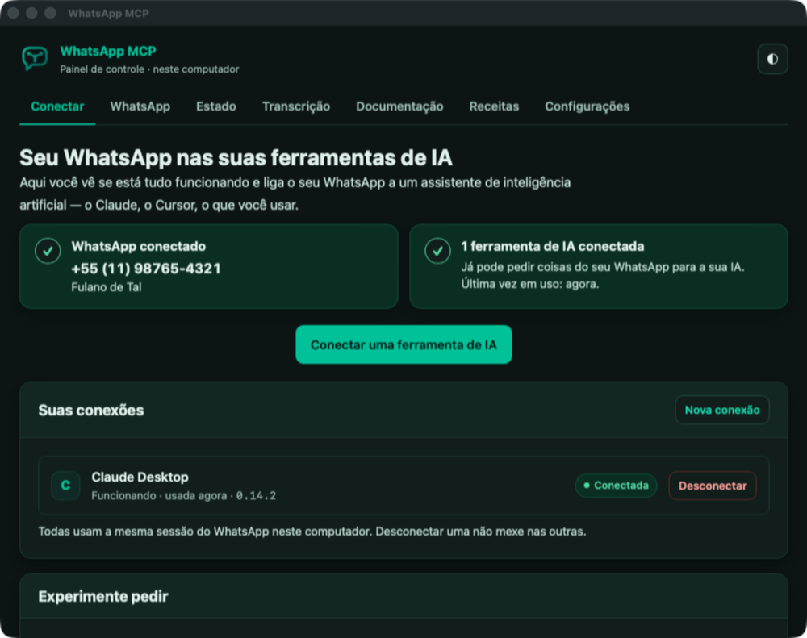
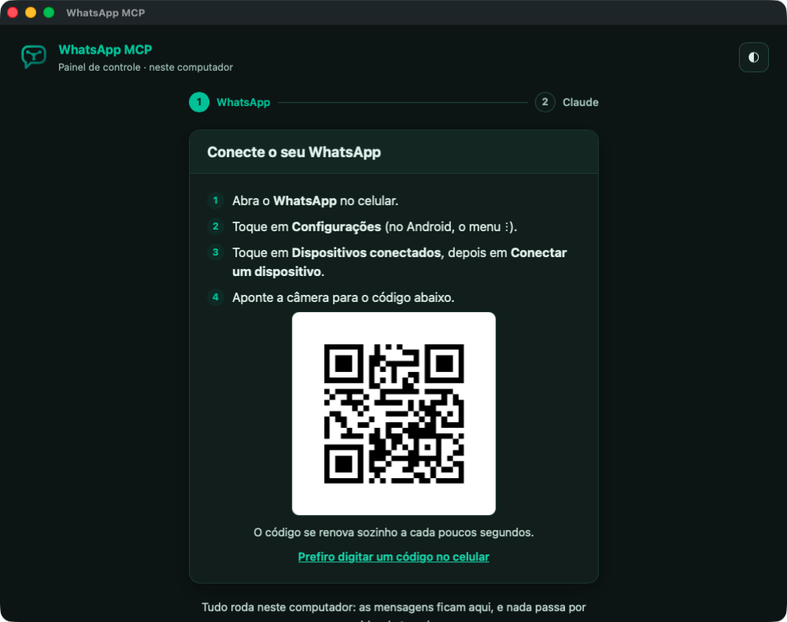
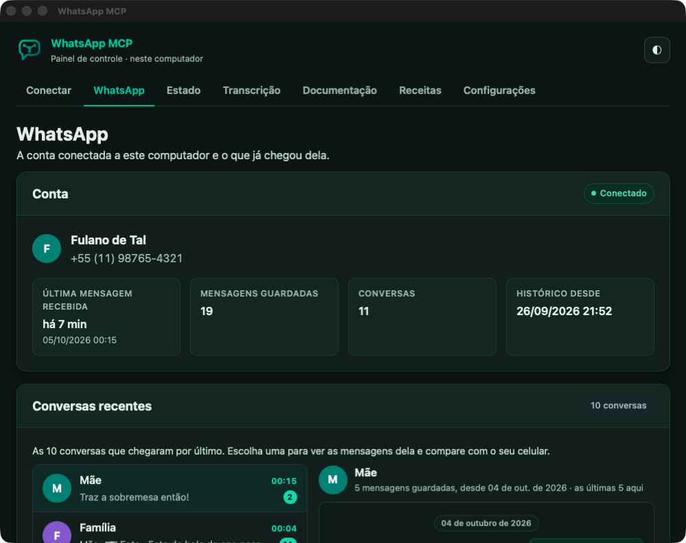

<p align="center">
  
</p>

<h1 align="center">WhatsApp MCP Local</h1>

<p align="center">
  <strong>O seu WhatsApp no Claude, rodando no seu próprio computador.</strong><br>
  Um app para macOS, Windows e Linux. Sem servidor, sem mensalidade: as mensagens ficam na sua máquina.
</p>

<p align="center">
  
</p>

Peça ao Claude para resumir uma conversa, achar aquela mensagem de meses atrás,
responder alguém, criar uma enquete ou transcrever um áudio, direto do seu
WhatsApp.

Site e downloads: **[whatsapp-mcp.brorlandi.xyz](https://whatsapp-mcp.brorlandi.xyz)**

> **Esta é a versão Local**, um app que roda no seu computador, sem servidor e
> sem mensalidade. Existe também a versão
> [WhatsApp MCP Servidor](https://github.com/BrOrlandi/whatsapp-mcp), em outro
> repositório.

## Baixar

Na [página da versão mais recente](https://github.com/BrOrlandi/whatsapp-mcp-local/releases/latest),
baixe o arquivo do seu sistema:

| Sistema | Arquivo | O que fazer |
|---|---|---|
| macOS 11 ou mais novo | `WhatsApp-MCP.dmg` | abra e arraste o WhatsApp MCP para Aplicativos |
| Windows 10 e 11 | `WhatsApp-MCP-Setup.exe` | rode o instalador; não pede senha de administrador |
| Linux | `WhatsApp-MCP-x86_64.AppImage` (ou `aarch64`) | torne executável (`chmod +x`) e abra |
| Ubuntu e Debian | `whatsapp-mcp_<versão>_amd64.deb` (ou `arm64`) | instale com `sudo apt install ./whatsapp-mcp_*.deb` |

Depois é só abrir o app:

1. **Leia o QR code** com o celular (*WhatsApp › Dispositivos conectados ›
   Conectar um dispositivo*), ou peça um código para digitar no celular.
2. **Conecte o Claude** com um clique: Claude Desktop (chat e Cowork) ou Claude
   Code. Para outras ferramentas, o app dá um texto pronto para colar nelas.

<p align="center">
  
</p>

> **No Windows**, o instalador ainda não é assinado. O Windows mostra "O
> Windows protegeu o computador": clique em **Mais informações** e depois em
> **Executar assim mesmo**.

## No dia a dia

- **O app fica na barra de menus** (no Windows, na área de notificação; no
  Linux, na bandeja). Fechar a janela não encerra o app: o Claude continua
  usando o WhatsApp. Para encerrar, use **Sair** no menu do ícone.
- **Abre sozinho quando o computador liga**, só na barra de menus, sem janela.
  Dá para desligar isso no menu do ícone ou em Configurações.
- **Atualiza sozinho.** Uma vez por dia o app procura uma versão nova; quando
  há, ele avisa, e um clique baixa, confere e reinicia na versão nova.
- **O endereço do MCP é `http://127.0.0.1:47821/mcp`**, que só responde a
  programas deste computador. Se outro programa já usar essa porta, o app avisa
  e troca por uma livre com um clique, em Configurações.

<p align="center">
  
</p>

## Prefere o terminal ou um servidor?

Para um servidor sem tela, um computador que fica ligado o tempo todo ou para
instalar com um agente de IA, existe a versão de linha de comando, sem janela.
Copie o texto abaixo e cole no **Claude Code**, no **Cowork** ou em qualquer
agente que rode comandos no seu computador:

```
Instale o WhatsApp MCP Local (versão de linha de comando) neste computador seguindo https://github.com/BrOrlandi/whatsapp-mcp-local.
Rode: curl -fsSL https://raw.githubusercontent.com/BrOrlandi/whatsapp-mcp-local/main/install.sh | bash
Se o download falhar (repositório privado), use: gh repo clone BrOrlandi/whatsapp-mcp-local && cd whatsapp-mcp-local && ./install.sh
Quando o painel abrir no navegador, me diga para escanear o QR code com o celular e depois conectar o Claude pelo próprio painel.
```

Ou rode direto:

```sh
curl -fsSL https://raw.githubusercontent.com/BrOrlandi/whatsapp-mcp-local/main/install.sh | bash
```

Funciona no macOS e no Linux, sem `sudo`. Ele instala o `whatsapp-mcp` como
serviço do sistema e abre o mesmo painel no navegador, em
**http://127.0.0.1:47821** (de novo: `whatsapp-mcp open`).

## Bom saber

- **Áudios viram texto no próprio computador, quando você pede.** Ative em
  *Transcrição*: o app baixa o Whisper (cerca de 600 MB, uma vez) e transcreve
  sem o áudio sair da máquina, usando a conversa como contexto para acertar
  nomes e termos. Com a GPU do Mac ou uma placa NVIDIA leva segundos; só com o
  processador, mais ou menos a duração do áudio.
- **O computador precisa estar ligado** para receber mensagens. Se ele ficar
  desligado por pouco tempo, o WhatsApp entrega o que ficou pendente quando ele
  volta.
- **Funciona com o Claude Desktop e o Claude Code** neste computador, e com
  outras ferramentas que aceitem MCP. O claude.ai no navegador e o app do
  celular não alcançam o seu computador; para usar o WhatsApp neles, existe a
  [versão Servidor](https://github.com/BrOrlandi/whatsapp-mcp).
- **Use por sua conta e risco.** O WhatsApp não tem API oficial para contas
  pessoais. Este projeto usa o [wacli](https://github.com/openclaw/wacli), um
  cliente não oficial, e a conta pode ser desconectada ou restringida.

[Como funciona](docs/como-funciona.md) ·
[Transcrição](docs/transcricao.md) ·
[Dependências](docs/dependencias.md) ·
[Desenvolvimento](docs/desenvolvimento.md) ·
[Apoie o projeto](https://donate.stripe.com/8x200jdhA6c1d375jF9Ve06)

<sub>MIT · feito por [Bruno Orlandi](https://github.com/BrOrlandi)</sub>
